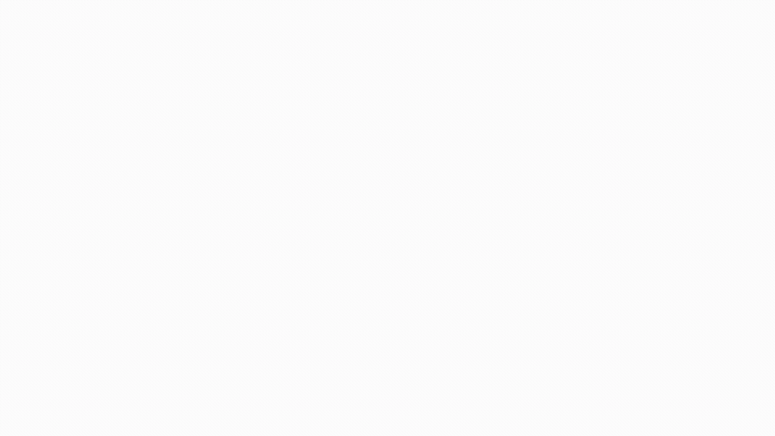

<p align="center">
  
  
  
  
  
  
</p>

<h1 align="center">AURORA</h1>

<p align="center">
  <strong>Light that understands you</strong><br/>
  <em>An award-style product landing for a fictional ambient smart lamp — an animation craft showcase</em>
</p>

<p align="center">
  <strong><a href="https://aurora-landing-kappa.vercel.app">Live Demo</a></strong>
</p>



---

## What it demonstrates

AURORA is a scroll-driven, one-page experience built to show motion design engineering — the kind of work behind premium product landings:

- **Hero** — display typography revealed character by character with SplitText, a glowing aurora orb with scroll parallax, and a magnetic CTA with elastic release
- **Manifesto** — Apple-style copy that lights up word by word, scrubbed to scroll position
- **Anatomy** — a procedural 3D lamp (React Three Fiber) that explodes into its four parts inside a pinned scene as you scroll, with part labels revealed from the same timeline
- **Specs** — numbers that count up to their value on viewport entry
- **Colorways** — a selection ring that travels between swatches with GSAP Flip while the glow changes mood
- **Finale** — masked line reveals and a real-progress preloader on first load

## Measured performance (CPU throttled 4×)

- **LCP: 182 ms** (TTFB 56 ms + render delay 126 ms)
- **CLS on load: 0.00**
- No long-task insights during a full-page scripted scroll in the performance trace
- The 3D canvas loads client-only via `next/dynamic` and caps `dpr` at 1.5

## Architecture decisions

- **Scroll progress travels through a ref, not React state.** The pinned ScrollTrigger writes its progress into a ref consumed by `useFrame` with lerp smoothing — zero React re-renders during scroll, which is how the scene holds 60fps.
- **Procedural 3D instead of downloaded models.** The lamp is four groups of primitives with emissive materials: no GLTF downloads, no Draco decoding, near-zero asset weight, instant load.
- **Lenis driven by the GSAP ticker** (the official integration pattern), so smooth scroll and ScrollTrigger share one clock.
- **`prefers-reduced-motion` is a full variant, not an afterthought.** It disables Lenis and every tween, and renders the lamp in a static exploded state — all content stays readable with zero motion.
- **An honest preloader.** Progress tracks real signals (`document.fonts.ready` and `window load`), not a fake timer.

## Getting started

```bash
git clone https://github.com/rramirezgit/aurora-landing.git
cd aurora-landing
pnpm install
pnpm dev
```

```bash
pnpm build     # Production build
pnpm lint      # ESLint
```

## Stack

Next.js 16 (App Router) · React 19 · TypeScript strict · GSAP 3.13 (ScrollTrigger, SplitText, Flip) via `@gsap/react` · Lenis · React Three Fiber 9 + three.js · Tailwind CSS 4 · Space Grotesk variable font

---

<sub>AURORA is a fictional product. Built by <a href="https://github.com/rramirezgit">Ricardo Ramirez</a> as part of a frontend portfolio — see the <a href="https://ricardoramirez-dev.vercel.app/work/aurora">full case study</a>.</sub>
